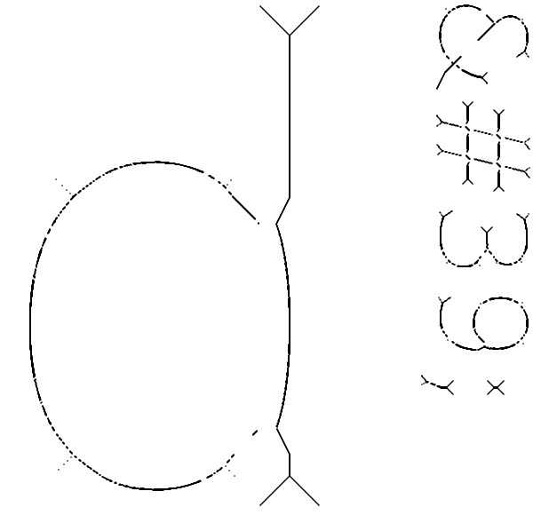

# marching-squares

Implementation of the [marching
squares](https://en.wikipedia.org/wiki/Marching_squares) algorithm to find the
boundaries of shapes given a scalar field. This algorithm can also be used to
generate heightmaps or to find the medial axis of a shape.

To understand what the library can do take a look at the examples.

```bash
$ cargo run --release --example function
$ cargo run --release --example heightmap data/italy.png
$ cargo run --release --example medial_axis data/logo.png 20
```



